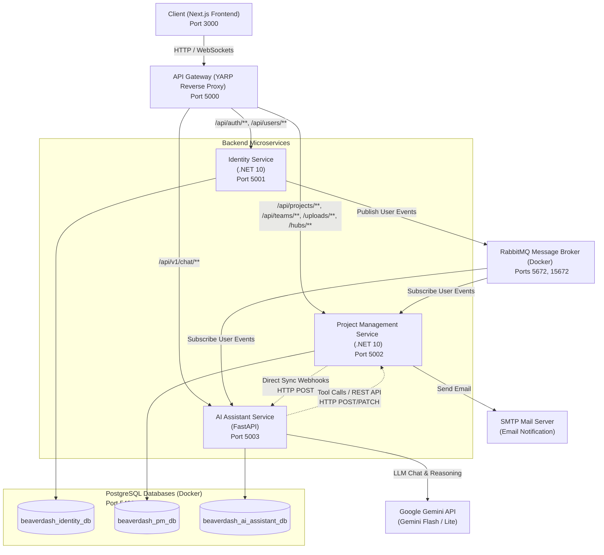

# Beaverdash - Hệ Thống Quản Lý Dự Án Kanban Tích Hợp Trợ Lý AI

**Beaverdash** là một hệ thống quản lý công việc và dự án theo mô hình Kanban nâng cao, được xây dựng trên kiến trúc **Microservices** tách biệt, kết hợp với **Trợ lý AI thông minh** (hỗ trợ phân tích tài liệu và tự động tạo kế hoạch công việc).

---

## 1. Mục Tiêu Đồ Án

*   **Quản lý dự án trực quan:** Cung cấp bảng Kanban kéo thả mượt mà, phân tách công việc chi tiết thành Task chính và Sub-task (checklist), hỗ trợ làm việc nhóm và thảo luận trực tiếp.
*   **Tích hợp Trợ lý AI (AI Assistant):** Tự động phân tích tài liệu dự án (Word, PDF, Excel) thông qua kỹ thuật **RAG (Retrieval-Augmented Generation)** và tự động hóa thao tác (lên kế hoạch, tạo task, phân công) bằng **Function Calling (Gọi công cụ)**.
*   **Kiến trúc Microservices hiện đại:** Áp dụng các mẫu thiết kế **Clean Architecture, CQRS (MediatR), API Gateway (YARP), Event-driven Microservices (RabbitMQ)**, và cô lập dữ liệu hoàn toàn (**Database-per-Service**).
*   **Thời gian thực (Real-time):** Gửi thông báo tức thời đến thành viên nhóm qua **SignalR (Websockets)** khi có thay đổi trạng thái hoặc bình luận mới.

---

## 2. Kiến Trúc Hệ Thống (System Architecture)

Hệ thống bao gồm các thành phần dịch vụ độc lập kết nối với nhau:



### Các Thành Phần Trong Hệ Thống:

1.  **Frontend Web ([web](file:///d:/beaverdash/web)):** Xây dựng bằng Next.js (React 19, Tailwind CSS v4), giao tiếp với Backend thông qua API Gateway tại port 5000 và nhận thông báo real-time qua SignalR.
2.  **API Gateway ([ApiGateway](file:///d:/beaverdash/ApiGateway)):** Định tuyến duy nhất (YARP Reverse Proxy chạy trên .NET 10), nhận request từ client để chuyển tiếp đến các service thích hợp, đồng thời xử lý CORS và JWT offloading.
3.  **Identity Service ([IdentityService](file:///d:/beaverdash/IdentityService)):** Sử dụng .NET 10 C#, quản lý tài khoản người dùng, xác thực Google Sign-In và cấp phát JWT.
4.  **Project Management Service ([ProjectManagementService](file:///d:/beaverdash/ProjectManagementService)):** Nghiệp vụ cốt lõi (.NET 10 C#), quản lý Kanban board, sprints, tasks, sub-tasks, comments, attachments (lưu trữ file cục bộ), notifications, activity logs.
5.  **AI Assistant Service ([AIAssistantService](file:///d:/beaverdash/AIAssistantService)):** Sử dụng Python FastAPI, xử lý file tài liệu (Word, PDF, Excel) thành vector embedding lưu vào database postgres (pgvector extension) phục vụ hỏi đáp thông minh (RAG) và gọi các endpoint PM API thông qua cơ chế Function Calling.
6.  **Database & Broker:** 
    *   PostgreSQL (Port 5432): Chia làm 3 database riêng biệt cho từng service.
    *   RabbitMQ (Ports 5672, 15672): Broker trung gian đồng bộ thông tin người dùng bất đồng bộ giữa Identity Service với PM Service và AI Service.

---

## 3. Các Phần Mềm Cần Thiết (Prerequisites)

*   **Docker / Docker Desktop:** Để chạy PostgreSQL (pgvector) và RabbitMQ.
*   **SDK .NET 10.0:** Dành cho các dịch vụ Backend (.NET).
*   **Node.js (v18+):** Dành cho Frontend Next.js.
*   **Python 3.11+:** Dành cho dịch vụ AI Assistant.
*   **Cloudflared CLI:** (Nếu chạy file batch khởi động kèm tunnel).

---

## 4. Cài Đặt & Chạy Chương Trình

Hệ thống hỗ trợ cấu hình và khởi chạy linh hoạt thông qua các bước dưới đây:

### Bước 1: Tạo file cấu hình môi trường `.env`
Sao chép file cấu hình mẫu `.env.example` thành `.env` ở thư mục gốc:
```bash
cp .env.example .env
```
Cấu hình các giá trị thực tế của bạn như mật khẩu DB (`POSTGRES_PASSWORD`), khóa bảo mật JWT (`JWT_SECRET`), các cổng SMTP để gửi email và đặc biệt là `GEMINI_API_KEY` của bạn.

---

### Cách 1: Chạy Hybrid (Phục vụ phát triển & Debug)

Chạy cơ sở hạ tầng nền bằng Docker và chạy các Service trực tiếp trên máy host để hỗ trợ Debug/Hot reload.

#### 1. Khởi động hạ tầng (Database & RabbitMQ)
Chạy lệnh compose tại thư mục gốc:
```bash
docker compose up -d postgres rabbitmq
```
*Lưu ý:* Postgres sẽ khởi tạo tự động 3 database tách biệt: `beaverdash_identity_db`, `beaverdash_pm_db`, `beaverdash_ai_assistant_db`.

#### 2. Cập nhật migrations & chạy các service Backend C#
Mở các cửa sổ terminal riêng biệt và chạy các lệnh sau:

*   **API Gateway (Port 5000):**
    ```bash
    cd ApiGateway
    dotnet run
    ```
*   **Identity Service (Port 5001):**
    ```bash
    cd IdentityService/src/Identity.API
    dotnet ef database update
    dotnet run
    ```
*   **Project Management Service (Port 5002):**
    ```bash
    cd ProjectManagementService/src/PM.API
    dotnet ef database update
    dotnet run
    ```

#### 3. Chạy AI Assistant Service (FastAPI - Port 5003)
Mở terminal tại thư mục `AIAssistantService`:
```bash
cd AIAssistantService
python -m venv .venv
# Kích hoạt môi trường ảo (.venv)
.venv\Scripts\activate      # Windows
source .venv/bin/activate   # macOS/Linux

pip install -r requirements.txt
uvicorn app.main:app --host 0.0.0.0 --port 5003 --reload
```

#### 4. Chạy Frontend Next.js (Port 3000)
Mở terminal tại thư mục `web`:
```bash
cd web
npm install
npm run dev
```

---

### Cách 2: Triển Khai Toàn Bộ Bằng Docker Compose

Bạn có thể chạy toàn bộ hệ thống (bao gồm cả các service nghiệp vụ và frontend) trực tiếp trên các container Docker:

```bash
docker compose up --build
```
Hệ thống sẽ tự động build các image từ Dockerfile và khởi chạy. 
*   **Frontend Web:** [http://localhost:3000](http://localhost:3000)
*   **API Gateway:** [http://localhost:5000](http://localhost:5000)
*   **RabbitMQ Dashboard:** [http://localhost:15672](http://localhost:15672)

---

### Cách 3: Chạy nhanh bằng file start.bat (Môi trường Windows)

Nếu bạn ở trên Windows và đã cài đặt `cloudflared` CLI, bạn có thể chạy file:
```cmd
start.bat
```
File script này sẽ tự động khởi động các container Docker Compose ngầm, đồng thời tạo ra một Cloudflare Tunnel ánh xạ API Gateway (`http://localhost:5000`) ra internet thông qua tunnel tên `beaverdash-backend` để liên kết bên ngoài. Truy cập link: https:beaverdash.xyz
