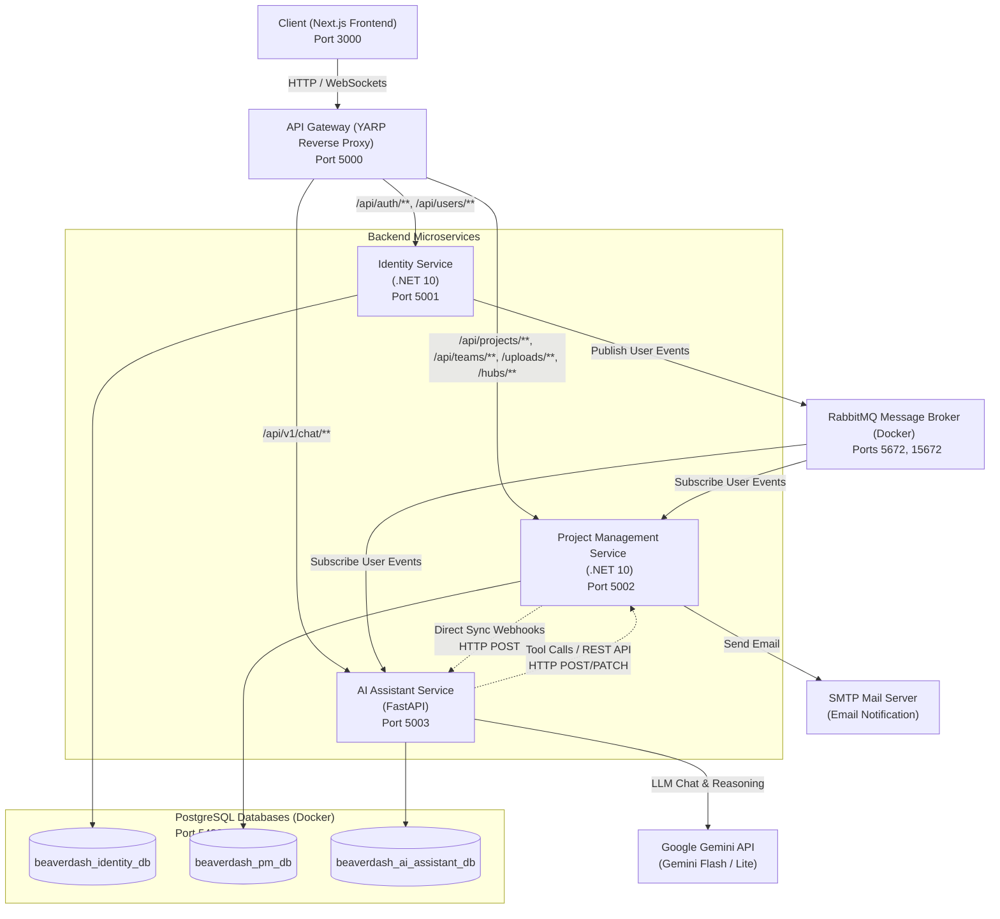

# Beaverdash - Hệ Thống Quản Lý Dự Án Kanban Tích Hợp Trợ Lý AI

**Beaverdash** là một hệ thống quản lý công việc và dự án theo mô hình Kanban nâng cao, được xây dựng trên kiến trúc **Microservices** hiện đại, kết hợp với **Trợ lý AI thông minh** (hỗ trợ phân tích tài liệu và tự động tạo kế hoạch công việc).

---

## 1. Mục Tiêu Đồ Án

*   **Tối ưu hóa quản lý dự án:** Cung cấp bảng Kanban trực quan hỗ trợ kéo thả mượt mà, phân rã công việc chi tiết thành Task chính và Sub-task (checklist), hỗ trợ làm việc nhóm và thảo luận trực tiếp.
*   **Tích hợp Trí tuệ Nhân tạo (AI Assistant):** Tích hợp LLM để tự động phân tích tài liệu dự án (Word, PDF, Excel) thông qua kỹ thuật **RAG (Retrieval-Augmented Generation)** và tự động hóa thao tác (lên kế hoạch, tạo task, phân công) bằng **Function Calling (Gọi công cụ)**.
*   **Thực hành kiến trúc Microservices:** Áp dụng các mẫu thiết kế hiện đại như **Clean Architecture, CQRS (MediatR), API Gateway (YARP), Event-driven Microservices (RabbitMQ)**, và cô lập dữ liệu hoàn toàn (**Database-per-Service**).
*   **Trải nghiệm thời gian thực (Real-time):** Gửi thông báo tức thời đến thành viên nhóm qua **SignalR (Websockets)** khi có thay đổi trạng thái hoặc bình luận mới.

---

## 2. Kiến Trúc Hệ Thống (System Architecture)

Hệ thống được thiết kế chia làm các thành phần độc lập giúp dễ dàng phát triển, mở rộng và bảo trì:



### Các Dịch Vụ Chính:

1.  **Next.js Frontend (Thư mục [web](file:///d:/beaverdash/web)):**
    *   Sử dụng Next.js (React 19, Tailwind CSS v4) mang lại giao diện hiện đại, tối ưu SEO và tốc độ tải trang.
    *   Tích hợp SignalR Client để nhận thông báo real-time.
2.  **API Gateway (Thư mục [ApiGateway](file:///d:/beaverdash/ApiGateway)):**
    *   Xây dựng trên nền **YARP (Yet Another Reverse Proxy)** của Microsoft chạy trên .NET 10.
    *   Điểm tiếp nhận request duy nhất của Frontend, xử lý CORS, định tuyến và Offloading giải mã token JWT.
3.  **Identity Service (Thư mục [IdentityService](file:///d:/beaverdash/IdentityService)):**
    *   Sử dụng C# .NET 10, quản lý thông tin User, xác thực và phân quyền (JWT).
    *   Đồng bộ thông tin tài khoản sang các dịch vụ khác qua RabbitMQ Event Bus.
4.  **Project Management Service (Thư mục [ProjectManagementService](file:///d:/beaverdash/ProjectManagementService)):**
    *   Sử dụng C# .NET 10, thiết kế chuẩn Clean Architecture kết hợp CQRS.
    *   Quản trị cốt lõi: Dự án, Sprints, Kanban Board, Kéo thả Task (tự động tính vị trí thực `double precision` & WIP Limit), Sub-task, Lịch sử (Activity Logs), Thông báo nội bộ (SignalR) và Email Worker (SMTP).
5.  **AI Assistant Service (Thư mục [AIAssistantService](file:///d:/beaverdash/AIAssistantService)):**
    *   Sử dụng Python FastAPI. Hỗ trợ RAG (đọc tài liệu Word/PDF/Excel) bằng cách chia nhỏ chunk và lưu trữ vector embedding xuống PostgreSQL (sử dụng plugin `pgvector`).
    *   Sử dụng Gemini API/Groq để phân tích hội thoại và kích hoạt cơ chế Gọi công cụ (Function Calling) tạo/quản lý Task tự động trực tiếp trên PM Service.

---

## 3. Các Phần Mềm Cần Thiết (Prerequisites)

Để chạy dự án ở môi trường local hoặc deploy, máy tính cần cài đặt sẵn:

1.  **Docker Desktop:** Dành cho việc chạy cơ sở dữ liệu PostgreSQL (pgvector) và RabbitMQ.
2.  **SDK .NET 10.0:** Dành cho các dịch vụ Backend (Gateway, Identity, PM Service).
3.  **Node.js (v18.x hoặc v20.x trở lên):** Để chạy mã nguồn Frontend Next.js.
4.  **Python 3.11+:** Để chạy dịch vụ AI Assistant.
5.  **API Key:** Cần có ít nhất một **Google Gemini API Key** để sử dụng tính năng Chatbot AI.

---

## 4. Hướng Dẫn Cài Đặt & Chạy Chương Trình

Hệ thống hỗ trợ 2 cách chạy ở môi trường phát triển: **Chạy hybrid (Docker hạ tầng + code chạy local)** hoặc **Dockerize toàn bộ**.

### Bước 1: Thiết lập file cấu hình môi trường `.env`
Sao chép file mẫu `.env.example` thành `.env` nằm tại thư mục gốc của dự án:
```bash
cp .env.example .env
```
Mở file `.env` và cấu hình các giá trị thực tế của bạn, đặc biệt là:
*   `POSTGRES_PASSWORD`: Mật khẩu của cơ sở dữ liệu.
*   `JWT_SECRET`: Khóa bí mật dùng để mã hóa Token JWT (độ dài tối thiểu 32 ký tự).
*   `GEMINI_API_KEY`: API Key lấy từ Google AI Studio.
*   `SMTP_USER` & `SMTP_PASSWORD`: Tài khoản gửi mail thông báo.

---

### CÁCH 1: Chạy Hybrid (Khuyên dùng khi Dev/Debug)

Mô hình này giúp lập trình viên nâng cao hiệu suất làm việc bằng cách tận dụng tính năng Hot Reload (`dotnet watch`, `npm run dev`, `uvicorn --reload`).

#### 1. Khởi chạy Database & RabbitMQ (Docker)
Tại thư mục gốc, khởi chạy các container cơ sở dữ liệu và RabbitMQ:
```bash
docker compose up -d postgres rabbitmq
```
*Lưu ý:* Cơ sở dữ liệu Postgres sử dụng ảnh `pgvector/pgvector:pg15` hỗ trợ tìm kiếm vector. File `init.sql` sẽ tự động tạo sẵn 3 database độc lập: `beaverdash_identity_db`, `beaverdash_pm_db`, `beaverdash_ai_assistant_db`.

#### 2. Cập nhật Migrations và chạy Backend Services (.NET)
Mở các terminal riêng biệt để chạy 3 service .NET:

*   **API Gateway (Port 5000):**
    ```bash
    cd ApiGateway
    dotnet run
    ```
*   **Identity Service (Port 5001):**
    ```bash
    cd IdentityService/src/Identity.API
    dotnet ef database update  # Chạy migration lần đầu
    dotnet run
    ```
*   **Project Management Service (Port 5002):**
    ```bash
    cd ProjectManagementService/src/PM.API
    dotnet ef database update  # Chạy migration lần đầu
    dotnet run
    ```

#### 3. Cài đặt và chạy AI Assistant Service (Python FastAPI - Port 5003)
Mở terminal tại thư mục `AIAssistantService`:
```bash
cd AIAssistantService
# Tạo môi trường ảo python
python -m venv .venv
# Kích hoạt môi trường ảo (Windows)
.venv\Scripts\activate
# Kích hoạt môi trường ảo (macOS/Linux)
source .venv/bin/activate

# Cài đặt thư viện cần thiết
pip install -r requirements.txt

# Khởi chạy dịch vụ AI
uvicorn app.main:app --host 0.0.0.0 --port 5003 --reload
```

#### 4. Khởi chạy Frontend (Next.js - Port 3000)
Mở terminal tại thư mục `web`:
```bash
cd web
npm install
npm run dev
```
Truy cập [http://localhost:3000](http://localhost:3000) để trải nghiệm ứng dụng.

*Mẹo trên Windows:* Bạn có thể sử dụng file [start.bat](file:///d:/beaverdash/start.bat) để tự động hóa việc khởi động Docker Compose và mở Cloudflare Tunnel dự phòng.

---

### CÁCH 2: Triển Khai Toàn Bộ Bằng Docker Compose (Chỉ với 1 dòng lệnh)

Nếu bạn không muốn cài đặt cục bộ .NET, Node.js hoặc Python, bạn có thể chạy toàn bộ hệ thống (bao gồm cả các service backend) bên trong Docker:

```bash
docker compose up --build
```

Lệnh này sẽ tự động xây dựng các Dockerfile của từng dịch vụ và chạy liên kết chúng lại với nhau thông qua mạng nội bộ Docker. Sau khi khởi chạy thành công:
*   **Frontend Next.js:** [http://localhost:3000](http://localhost:3000)
*   **API Gateway:** [http://localhost:5000](http://localhost:5000)
*   **RabbitMQ Management Portal:** [http://localhost:15672](http://localhost:15672) (User/Pass mặc định: `guest`/`guest` hoặc theo cấu hình `.env`)

---

## 6. Khuyến Khích Triển Khai Thực Tế (Hosting & Production)

Để triển khai dự án lên môi trường production thật, sinh viên nên cấu hình theo khuyến nghị sau:

### 1. Triển khai Cơ sở dữ liệu và RabbitMQ
*   Sử dụng các dịch vụ cloud database như **Supabase**, **Neon** (PostgreSQL có sẵn `pgvector`) để lưu trữ dữ liệu bền vững.
*   Sử dụng Cloud RabbitMQ Broker (như **CloudAMQP**) hoặc tự deploy một instance RabbitMQ trên VPS.

### 2. Triển khai các Service Backend bằng Docker (Dockerize)
*   Đóng gói các service `.NET 10` và `FastAPI` thành Docker Image bằng Dockerfile có sẵn trong từng thư mục.
*   Deploy các container này lên các dịch vụ Cloud như **Render**, **Fly.io**, **AWS ECS** hoặc thuê **VPS Linux** riêng để chạy `docker-compose`.

### 3. Deploy Frontend Web
*   Đẩy mã nguồn thư mục `web` lên GitHub.
*   Liên kết và deploy trực tiếp lên **Vercel** hoặc **Netlify** để được tối ưu hóa Edge Network cho Next.js, tự động cấp phát SSL miễn phí.

### 4. Thiết lập API Gateway và bảo mật HTTPS
*   Cấu hình Domain và trỏ SSL (HTTPS) thông qua **Cloudflare**.
*   Sử dụng **Cloudflare Tunnel** (như cấu hình trong [start.bat](file:///d:/beaverdash/start.bat)) để kết nối an toàn từ máy chủ local/VPS ra môi trường internet mà không cần mở port modem.
