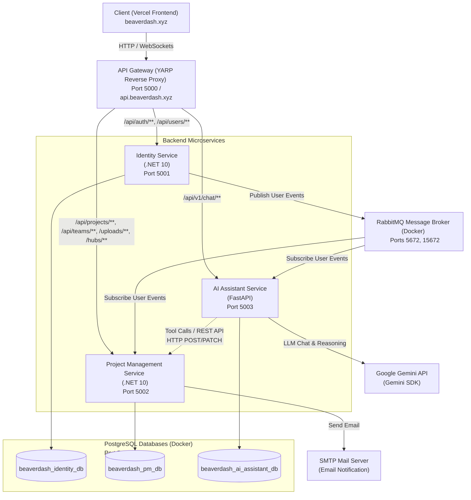

# Beaverdash - Hệ Thống Quản Lý Dự Án Kanban Kết Hợp Sprint & Trợ Lý AI

**Beaverdash** là một hệ thống quản lý công việc và dự án theo mô hình Kanban kết hợp Sprint, được xây dựng trên kiến trúc **Microservices** tách biệt, tích hợp với **Trợ lý AI thông minh** thông qua cơ chế Gọi công cụ (**Function Calling**).

---

## 1. Mục Tiêu Đồ Án

*   **Quản lý dự án trực quan (Kanban & Sprint):** Cung cấp bảng Kanban kéo thả mượt mà, phân chia dự án theo các Sprint (hoặc Product Backlog), phân tách công việc chi tiết thành Task chính và Sub-task (checklist), hỗ trợ làm việc nhóm và thảo luận trực tiếp.
*   **Trợ lý AI thông minh (Function Calling):** Tích hợp mô hình ngôn ngữ lớn (LLM - Google Gemini) để tự động hóa lập kế hoạch và khởi tạo công việc. AI giao tiếp với người dùng và có khả năng tự động gọi các API tạo Sprint, tạo Task, Sub-task, cập nhật trạng thái... tương tác trực tiếp với cơ sở dữ liệu dự án.
*   **Kiến trúc Microservices hiện đại:** Áp dụng các mẫu thiết kế **Clean Architecture, CQRS (MediatR), API Gateway (YARP), Event-driven Microservices (RabbitMQ)**, và cô lập dữ liệu hoàn toàn (**Database-per-Service**).
*   **Thời gian thực (Real-time):** Gửi thông báo tức thời đến thành viên nhóm qua **SignalR (Websockets)** khi có thay đổi trạng thái công việc hoặc bình luận mới.

---

## 2. Kiến Trúc Hệ Thống (System Architecture)

Hệ thống bao gồm các dịch vụ độc lập kết nối với nhau qua môi trường API Gateway và RabbitMQ Event Bus:



### Các Thành Phần Trong Hệ Thống:

1.  **Frontend Web (Next.js):** Đã được triển khai trên nền tảng **Vercel** tại địa chỉ chính thức [beaverdash.xyz](https://beaverdash.xyz). Giao diện sử dụng Next.js (React 19, Tailwind CSS v4) và SignalR Client để tương tác thời gian thực.
2.  **API Gateway ([ApiGateway](file:///d:/beaverdash/ApiGateway)):** Định tuyến duy nhất sử dụng **YARP Reverse Proxy** (.NET 10). Tiếp nhận các cuộc gọi từ client để phân phối đến các service tương ứng, đồng thời xử lý CORS và JWT offloading.
3.  **Identity Service ([IdentityService](file:///d:/beaverdash/IdentityService)):** Sử dụng .NET 10 C#, quản lý tài khoản người dùng, xác thực đăng nhập Google Sign-In và cấp phát JWT.
4.  **Project Management Service ([ProjectManagementService](file:///d:/beaverdash/ProjectManagementService)):** Nghiệp vụ cốt lõi quản lý Kanban board, sprints, tasks, sub-tasks, comments, attachments (lưu trữ file vật lý cục bộ), notifications, activity logs.
5.  **AI Assistant Service ([AIAssistantService](file:///d:/beaverdash/AIAssistantService)):** Dịch vụ Python FastAPI tương tác với LLM thông qua Gemini SDK. Cung cấp API Chatbot hỗ trợ lên kế hoạch dự án bằng cơ chế gọi công cụ (**Function Calling**) tự động gửi REST API tạo/cập nhật Sprint và Task đến PM Service.
6.  **Database & Broker:** 
    *   PostgreSQL (Port 5432): Chia làm 3 database riêng biệt cho từng service.
    *   RabbitMQ (Ports 5672, 15672): Message broker đồng bộ thông tin người dùng bất đồng bộ khi có sự kiện `UserCreatedEvent`.

---

## 3. Các Phần Mềm Cần Thiết (Prerequisites)

*   **Docker / Docker Desktop:** Để chạy PostgreSQL và RabbitMQ.
*   **SDK .NET 10.0:** Dành cho các dịch vụ Backend (.NET).
*   **Node.js (v18+):** Dành cho Frontend Next.js (nếu chạy local).
*   **Python 3.11+:** Dành cho dịch vụ AI Assistant (nếu chạy local).
*   **Cloudflared CLI:** Để chạy đường ống kết nối API Gateway với môi trường Production.

---

## 4. Hướng Dẫn Chạy Chương Trình & Chạy Demo

Hệ thống hỗ trợ chạy local và kết nối trực tiếp với Frontend đã deploy trên Vercel bằng Cloudflare Tunnel.

### CÁCH 1: Chạy Demo Kết Hợp Với Frontend Vercel (Khuyên Dùng Để Báo Cáo)

Sử dụng trực tiếp Frontend đã deploy tại [beaverdash.xyz](https://beaverdash.xyz) kết nối về Backend chạy dưới máy local của bạn thông qua Cloudflare Tunnel:

1.  Cài đặt công cụ `cloudflared` trên máy tính.
2.  Sao chép file cấu hình `.env.example` thành `.env` ở thư mục gốc và điền đầy đủ thông số (đặc biệt là `GEMINI_API_KEY`).
3.  Chạy file:
    ```cmd
    start.bat
    ```
    *Script này sẽ khởi động toàn bộ hạ tầng cơ sở dữ liệu và các microservices backend trong Docker Compose, đồng thời kích hoạt tunnel chuyển tiếp traffic từ internet (`api.beaverdash.xyz`) về Gateway cổng 5000 tại máy của bạn.*
4.  Truy cập trực tiếp [https://beaverdash.xyz](https://beaverdash.xyz) để thao tác và demo.

---

### CÁCH 2: Chạy Local Hoàn Toàn (Chạy Hybrid)

#### 1. Khởi động hạ tầng Docker
Chạy lệnh compose tại thư mục gốc để khởi động DB & RabbitMQ:
```bash
docker compose up -d postgres rabbitmq
```

#### 2. Chạy các service Backend C# (.NET)
Mở các cửa sổ terminal riêng biệt và chạy:
*   **API Gateway (Port 5000):**
    ```bash
    cd ApiGateway
    dotnet run
    ```
*   **Identity Service (Port 5001):**
    ```bash
    cd IdentityService/src/Identity.API
    dotnet ef database update
    dotnet run
    ```
*   **Project Management Service (Port 5002):**
    ```bash
    cd ProjectManagementService/src/PM.API
    dotnet ef database update
    dotnet run
    ```

#### 3. Chạy AI Assistant Service (FastAPI - Port 5003)
Mở terminal tại thư mục `AIAssistantService`:
```bash
cd AIAssistantService
python -m venv .venv
# Kích hoạt môi trường ảo (.venv)
.venv\Scripts\activate      # Windows
source .venv/bin/activate   # macOS/Linux

pip install -r requirements.txt
uvicorn app.main:app --host 0.0.0.0 --port 5003 --reload
```

#### 4. Chạy Frontend Next.js Local (Port 3000)
Mở terminal tại thư mục `web`:
```bash
cd web
npm install
npm run dev
```
Truy cập [http://localhost:3000](http://localhost:3000) để chạy thử trên local.
